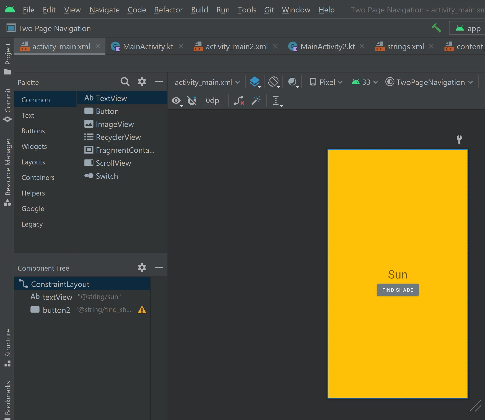
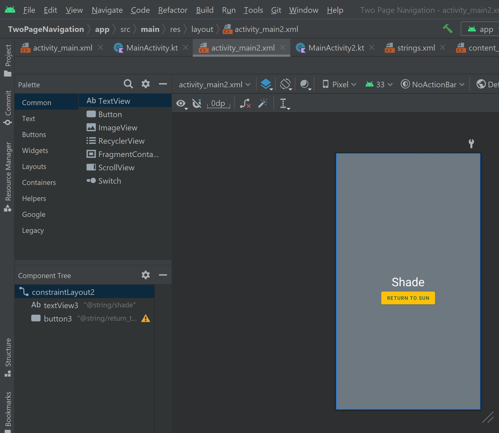

# SunVShade
My first two-page app using Android Studio and Kotlin.

# Implementation 
I created this using Android Studio as my IDE. This was my first time using Kotlin.
It's very easy to get an app up and running in Android Studio. I am working on another project now.

# Design Process
The purpose was for a CSS 545 Mobile Computing at UW Bothell. This was our initial project to get us started.

# The Future
I plan to build on this and use this as the home screen for an app. More to come!
